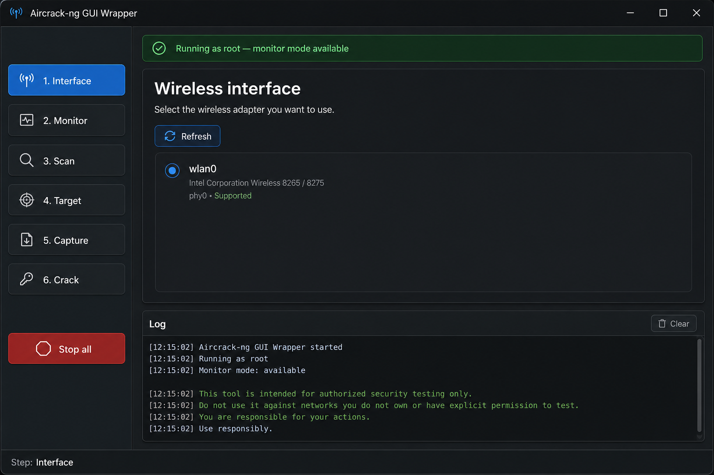
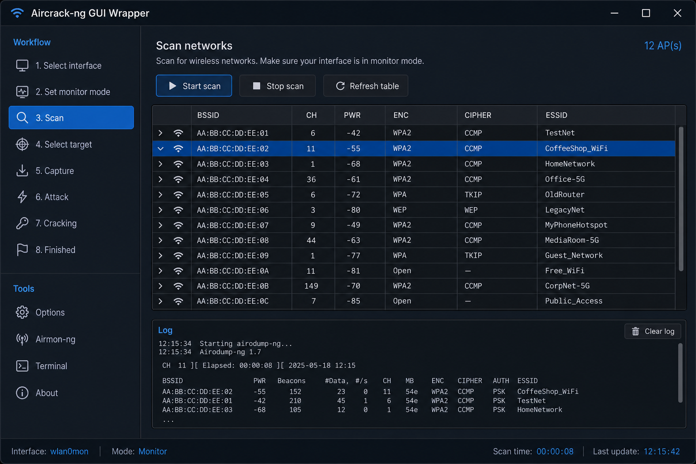
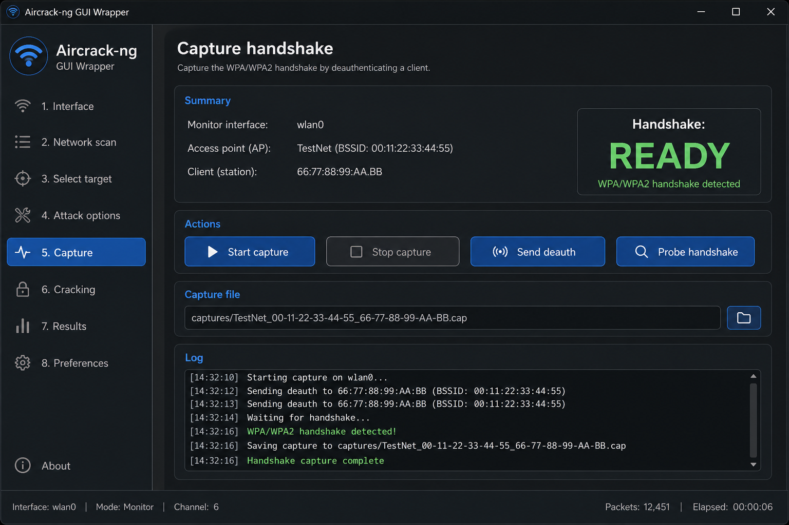
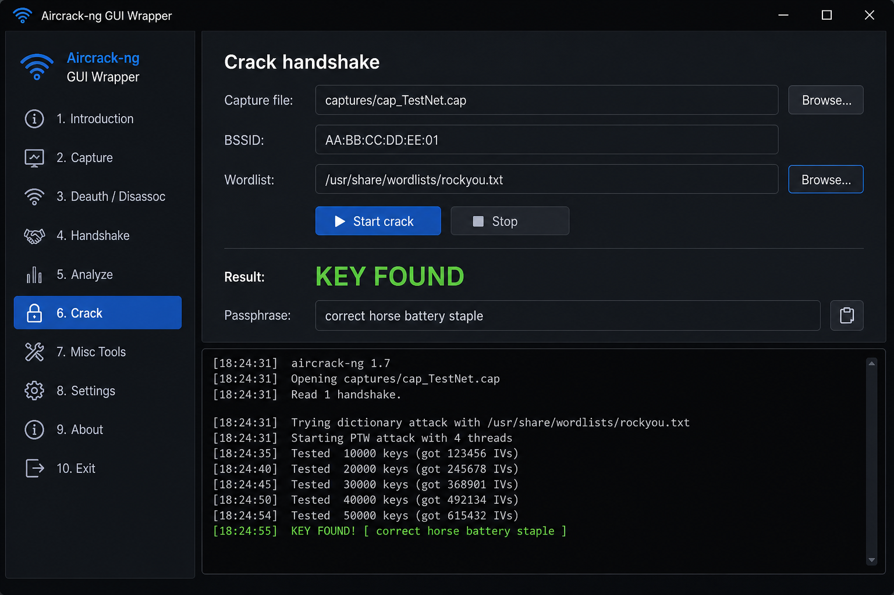

# Aircrack-ng GUI Wrapper

Desktop GUI (Python + CustomTkinter) for the classic **WPA/WPA2-PSK** audit flow on Kali Linux. All steps run from the UI — no manual CLI required.

## Legal notice

Use this tool **only** on networks you own or have **written authorization** to test. Unauthorized access to wireless networks is illegal.

## Requirements

- Kali Linux (or similar) with root privileges
- `aircrack-ng` suite (`airmon-ng`, `airodump-ng`, `aireplay-ng`, `aircrack-ng`)
- Wi-Fi adapter that supports **monitor mode** and **packet injection**
- Python 3.10+

## Install (Kali)

Kali blocks system-wide pip (`externally-managed-environment`). Use a **virtualenv**:

```bash
sudo apt update
sudo apt install -y aircrack-ng python3-tk python3-venv python3-full
chmod +x setup.sh run.sh
./setup.sh
```

Full walkthrough: [INSTALL_KALI.md](INSTALL_KALI.md)

## Run

```bash
./run.sh
```

Equivalent:

```bash
sudo .venv/bin/python main.py
```

Do **not** use `sudo python3 main.py` after a venv install — that bypasses `.venv` and will miss `customtkinter`.

## Screenshots

Interface selection:



Network scan:



Handshake capture:



Wordlist crack:



## Workflow (GUI steps)

1. **Interface** — list wireless NICs and select one  
2. **Monitor** — kill interfering processes; start/stop monitor mode  
3. **Scan** — discover APs (BSSID, channel, power, encryption, ESSID)  
4. **Target** — pick an AP and an associated client  
5. **Capture** — focused capture + optional deauth; wait for handshake  
6. **Crack** — choose a wordlist and run `aircrack-ng`

Captures are written under `captures/`.

## Adapter tips

Not every built-in Wi-Fi chip supports monitor/injection. USB adapters commonly used for auditing (Atheros, Ralink, Realtek with proper drivers) work more reliably. If monitor mode fails, try another interface or driver.
